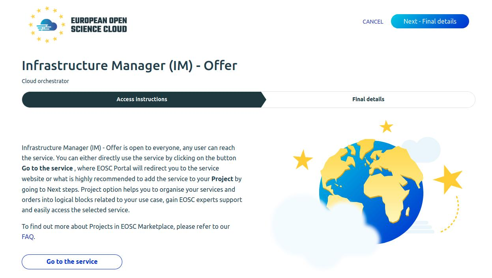
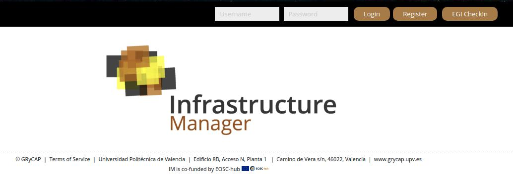

# IM Synergy
Infrastructure Manager instructions and applications for synergy project.

# Using the online IM Dashboard
Infrastrutrue Manager offers an onlyne service on the EOSC market place. it is available for all users therefore can be use in the Synergy project:

Advantages:
-
- Already running instance out of synergy resources.
- Maintenance out of the scope of synergy project.
- Simple usage of resources registered in [AppDB](https://appdb.egi.eu/).

Disadvantages:
- 
- To run customised TOSCA templates requires suport from UPV.

## Usage: [./im-eosc/dashboard/README.md](./im-eosc/dashboard/README.md)

# Using the IM-Web (online or local)
More detailed version of the IM Dashboard which offers more configuration options (at complexity cost). 

Advantages:
-
- Local instance with high customization features.
- Can run customised TOSCA templates.

Disadvantages:
- 
- Maintenance and resources would have to be inside synergy project.
- Some issues are still not solved.

## Usage eosc: [./im-eosc/im-web/README.md](./im-eosc/im-web/README.md) 
## Usage local: [./im-local/im-web/README.md](./im-local/im-web/README.md) 

# Creating custom TOSCA templates
Graphical User Interface to generate tosca templates. Also it is a tool to interface orchestrators, but it is not currently in the scope of synergy project.

## Usage: [./a4c-deep/README.md](./a4c-deep/README.md)
